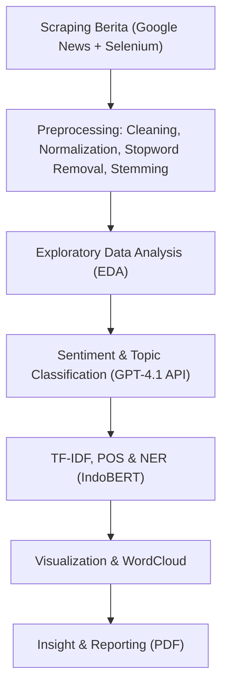

# 🦅 Analisis Sentimen, POS, dan NER Garuda Indonesia pada Artikel Berita

<p align="center">
  <br>
  <b>Natural Language Processing Project — Departemen Sistem Informasi, ITS</b><br>
  <i>Semester Gasal 2025</i>
</p>

---

## 📘 Deskripsi Proyek

Proyek ini menganalisis bagaimana **maskapai Garuda Indonesia** diberitakan di media daring.  
Analisis dilakukan melalui integrasi tiga pendekatan utama *Natural Language Processing (NLP)*:

- 🔹 **Sentiment Analysis**
- 🔹 **Part-of-Speech (POS) Tagging**
- 🔹 **Named Entity Recognition (NER)**

Pendekatan mengombinasikan **TF-IDF**, **IndoBERT (untuk NER)**, dan **GPT-4.1** (untuk sentimen & re-tagging topik).

---

## 🚀 Pipeline Proyek



---

## 🧩 Struktur Repository

```text
📂 (root)
├── 1-Garuda Indonesia Reviews/
│   ├── 1-1-Scraping Reviews/
│   │   ├── flygaruda_data_scrapping.ipynb
│   │   └── garuda_reviews.csv
│   └── 1-2-Data Praprocessing Reviews/
│       ├── cleaned_garuda_reviews.csv
│       ├── colloquial-indonesian-lexicon.csv
│       ├── flygaruda_bow.ipynb
│       ├── flygaruda_eda.ipynb
│       ├── flygaruda_preprocess.ipynb
│       ├── flygaruda_regex.ipynb
│       ├── flygaruda_reviews_clean_label.csv
│       └── regex_garuda_reviews.csv
│
├── 2-Garuda Indonesia News Articles/
│   ├── 1-Akuisisi Data Scraping News Articles/
│   │   ├── 1-Scraping News Title and Link/
│   │   │   ├── Scraping_GarudaIndonesia_LinkNews.ipynb
│   │   │   ├── link_berita_garudaindonesia.csv
│   │   │   ├── link_berita_garudaindonesia.xlsx
│   │   │   └── link_berita_garudaindonesia_cleaned.csv
│   │   └── 2-Scraping and Cleaning News Content/
│   │       ├── data_link_berita_with_content.csv
│   │       ├── data_link_berita_with_content_cleaned.csv
│   │       ├── data_link_berita_with_content_cleaned_manual.csv
│   │       ├── py1-Scrap_Garuda_Indonesia_News_Content.ipynb
│   │       ├── py2-Clean_Garuda_Indonesia_News_Content.ipynb
│   │       └── py3-Data_Desc_Garuda_Indonesia_News_Content.ipynb
│   └── 2-Praproses dan Analisis News Articles/
│       ├── CSV Outputs-Inputs/
│       ├── py1-preprocess.ipynb
│       ├── py2-sentiment_tag_new.ipynb
│       ├── py3-EDA_rarewords_sentiment.ipynb
│       ├── py4-TF_IDF.ipynb
│       ├── py5-NER.ipynb
│       └── py6-POS.ipynb
│
├── report/
│   ├── 2025-1_Klp-11_Paper.pdf
│   └── figures/            # (opsional) output visualisasi
│
├── scripts/
│   ├── extract_images_pymupdf.py
│   └── utils_textprep.py
│
├── requirements.txt
└── README.md
```

---

## ⚙️ Instalasi & Menjalankan Notebook

```bash
# clone repository
git clone https://github.com/<username>/<repo>.git
cd <repo>

# buat virtual environment
python -m venv venv
# Windows
venv\Scripts\activate
# macOS/Linux
# source venv/bin/activate

# install dependensi
pip install -r requirements.txt

# jalankan notebook di Jupyter / VSCode
jupyter notebook
```

---

## 🧠 Model & Tools yang Digunakan

| Komponen | Deskripsi |
|---|---|
| **TF-IDF (scikit-learn)** | Ekstraksi fitur kata penting korpus berita |
| **IndoBERT-NER (cahya/bert-base-indonesian-NER)** | Deteksi entitas: orang, lokasi, organisasi |
| **GPT-4.1 (OpenAI API)** | Klasifikasi sentimen & re-tagging topik |
| **Sastrawi** | Stemming Bahasa Indonesia |
| **Matplotlib / WordCloud** | Visualisasi distribusi kata & sentimen |

---

## 🧩 Notebook Interaktif

**Reviews (ulasan penumpang)**
- `1-Garuda Indonesia Reviews/1-1-Scraping Reviews/flygaruda_data_scrapping.ipynb`
- `1-Garuda Indonesia Reviews/1-2-Data Praprocessing Reviews/flygaruda_preprocess.ipynb`
- `1-Garuda Indonesia Reviews/1-2-Data Praprocessing Reviews/flygaruda_regex.ipynb`
- `1-Garuda Indonesia Reviews/1-2-Data Praprocessing Reviews/flygaruda_eda.ipynb`
- `1-Garuda Indonesia Reviews/1-2-Data Praprocessing Reviews/flygaruda_bow.ipynb`

**News Articles (artikel berita)**
- `2-Garuda Indonesia News Articles/1-Akuisisi Data Scraping News Articles/1-Scraping News Title and Link/Scraping_GarudaIndonesia_LinkNews.ipynb`
- `2-Garuda Indonesia News Articles/1-Akuisisi Data Scraping News Articles/2-Scraping and Cleaning News Content/py1-Scrap_Garuda_Indonesia_News_Content.ipynb`
- `2-Garuda Indonesia News Articles/1-Akuisisi Data Scraping News Articles/2-Scraping and Cleaning News Content/py2-Clean_Garuda_Indonesia_News_Content.ipynb`
- `2-Garuda Indonesia News Articles/1-Akuisisi Data Scraping News Articles/2-Scraping and Cleaning News Content/py3-Data_Desc_Garuda_Indonesia_News_Content.ipynb`
- `2-Garuda Indonesia News Articles/2-Praproses dan Analisis News Articles/py1-preprocess.ipynb`
- `2-Garuda Indonesia News Articles/2-Praproses dan Analisis News Articles/py2-sentiment_tag_new.ipynb`
- `2-Garuda Indonesia News Articles/2-Praproses dan Analisis News Articles/py3-EDA_rarewords_sentiment.ipynb`
- `2-Garuda Indonesia News Articles/2-Praproses dan Analisis News Articles/py4-TF_IDF.ipynb`
- `2-Garuda Indonesia News Articles/2-Praproses dan Analisis News Articles/py5-NER.ipynb`
- `2-Garuda Indonesia News Articles/2-Praproses dan Analisis News Articles/py6-POS.ipynb`

> Catatan: seluruh notebook berjalan **lokal** di repo ini (tidak ada tautan Colab).

---

## 📊 Hasil Utama (Ringkas)

| Aspek | Temuan |
|---|---|
| 💬 **Distribusi Sentimen** | Didominasi *netral–positif* |
| 🧾 **Topik Dominan** | “Kinerja & Keuangan”, “Operasional & Pelayanan” |
| 🧍 **Entitas Populer** | *Erick Thohir*, *Kementerian BUMN*, *PT Garuda Indonesia (Persero) Tbk* |
| 🔠 **Kata TF-IDF Utama** | *laba*, *utang*, *restrukturisasi*, *pelayanan* |

<details>
<summary>📈 Tampilkan contoh visualisasi</summary>


</details>

---

## 👥 Anggota Kelompok

| Nama | NRP |
|---|---|
| Jason Ho | 5026221005 |
| Alfa Renaldo Aluska | 5026221144 |

---

## 🧾 Lisensi

Proyek ini bersifat akademik dan open-source di bawah lisensi [MIT License](LICENSE).

---

<p align="center">
  <b>🚀 Analisis Sentimen Garuda Indonesia</b><br>
  <i>“Data speaks louder than perception.”</i>
</p>
