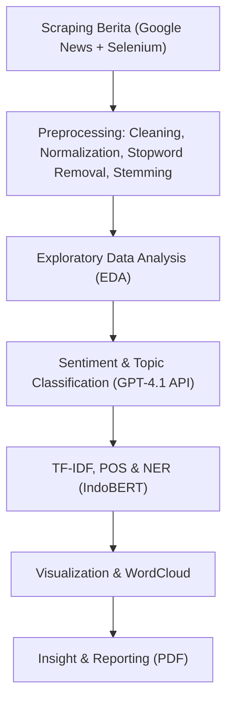

# 🦅 Analisis Sentimen, POS, dan NER Garuda Indonesia pada Artikel Berita

<p align="center">
  <br>
  <b>Natural Language Processing Project — Departemen Sistem Informasi, ITS</b><br>
  <i>Semester Gasal 2025</i>
</p>

---

## 📘 Deskripsi Proyek

Proyek ini merupakan bagian dari mata kuliah **Pengolahan Bahasa Alami (A)** yang menganalisis bagaimana **maskapai Garuda Indonesia** diberitakan di media daring.  
Analisis dilakukan melalui integrasi tiga pendekatan utama dalam *Natural Language Processing (NLP)*:

- 🔹 **Sentiment Analysis**
- 🔹 **Part-of-Speech (POS) Tagging**
- 🔹 **Named Entity Recognition (NER)**

Pendekatan yang digunakan mengombinasikan **TF-IDF**, **IndoBERT**, dan **GPT-4.1** untuk menghasilkan insight yang komprehensif mengenai persepsi publik terhadap Garuda Indonesia.

---

## 🚀 Pipeline Proyek



---

## 🧩 Struktur Repository

```bash
📂 garuda-sentiment-analysis
├── notebooks/
│   ├── 1_data_acquisition.ipynb
│   ├── 2_preprocessing.ipynb
│   ├── 3_analysis_EDA.ipynb
│   ├── 4_sentiment_pos_ner.ipynb
│   └── 5_visualization.ipynb
├── data/
│   ├── raw/                 # hasil scraping mentah
│   ├── processed/           # hasil preprocessing
│   └── cleaned/             # data siap analisis
├── report/
│   ├── 2025-1_Klp-11_Paper.pdf
│   └── figures/
├── scripts/
│   ├── extract_images_pymupdf.py
│   └── utils_textprep.py
├── requirements.txt
└── README.md
```

---

## ⚙️ Instalasi & Menjalankan Notebook

```bash
# clone repository
git clone https://github.com/<username>/garuda-sentiment-analysis.git
cd garuda-sentiment-analysis

# buat virtual environment
python -m venv venv
source venv/bin/activate  # Windows: venv\Scripts\activate

# install dependensi
pip install -r requirements.txt

# jalankan notebook di Jupyter atau VSCode
jupyter notebook
```

---

## 🧠 Model & Tools yang Digunakan

| Komponen | Deskripsi |
|-----------|------------|
| **TF-IDF (scikit-learn)** | Menghitung bobot kata penting dari korpus berita |
| **IndoBERT-NER (cahya/bert-base-indonesian-NER)** | Mengidentifikasi entitas seperti nama, lokasi, organisasi |
| **GPT-4.1 (OpenAI API)** | Menghasilkan label sentimen & kategori topik otomatis |
| **Sastrawi** | Proses stemming Bahasa Indonesia |
| **Matplotlib / WordCloud** | Visualisasi distribusi kata & sentimen |

---

## 📊 Hasil Utama

| Aspek | Temuan |
|-------|---------|
| 💬 **Distribusi Sentimen** | Didominasi *netral–positif*, menandakan citra media yang baik |
| 🧾 **Topik Dominan** | “Kinerja & Keuangan” serta “Operasional & Pelayanan” |
| 🧍 **Entitas Populer** | *Erick Thohir*, *Kementerian BUMN*, *PT Garuda Indonesia (Persero) Tbk* |
| 🔠 **Kata TF-IDF Utama** | *laba*, *utang*, *restrukturisasi*, *pelayanan* |

---

<details>
<summary>📈 Klik untuk melihat visualisasi utama</summary>


</details>

---

## 🧩 Interaktif & Eksperimen

Jalankan notebook interaktif berikut untuk bereksperimen langsung:
- [`notebooks/3_analysis_EDA.ipynb`](notebooks/3_analysis_EDA.ipynb)
- [`notebooks/4_sentiment_pos_ner.ipynb`](notebooks/4_sentiment_pos_ner.ipynb)

Atau buka versi *live* di Google Colab (jika tersedia):

👉 [**Open in Colab**](https://colab.research.google.com/github/<username>/garuda-sentiment-analysis/blob/main/notebooks/4_sentiment_pos_ner.ipynb)

---

## 🧾 Referensi Utama

Beberapa penelitian yang menjadi acuan:

- Pravina et al. (2019). *Analisis Sentimen Maskapai Penerbangan dengan SVM*  
- Telaumbanua (2023). *Analisis Sentimen Berbasis Aspek Garuda Indonesia*  
- Prasetyo et al. (2024). *Comparative Analysis of MultinomialNB, SVM, and BERT*  
- Rozi et al. (2019). *Hybrid Cuckoo Search pada Opini Pengguna Maskapai*  
- Salma (2022). *Online Public Sentiment Toward Corporate Crisis (Case of Garuda Indonesia)*  

---

## 👥 Anggota Kelompok

| Nama | NRP |
|------|-----|
| Jason Ho | 5026221005 |
| Alfa Renaldo Aluska | 5026221144 |

---

## 🧾 Lisensi

Proyek ini bersifat akademik dan open-source di bawah lisensi [MIT License](LICENSE).

---

<p align="center">
  <b>🚀 Analisis Sentimen Garuda Indonesia</b><br>
  <i>“Data speaks louder than perception.”</i>
</p>
