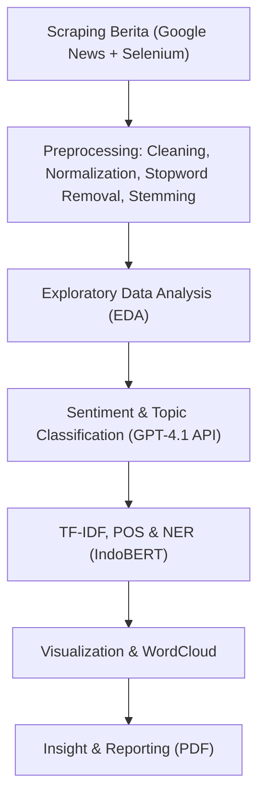

# 🦅 Analisis Sentimen, POS, dan NER Garuda Indonesia pada Artikel Berita

<p align="center">
  <br>
  <b>Natural Language Processing Project — Departemen Sistem Informasi, ITS</b><br>
  <i>Semester Gasal 2025</i>
</p>

---

## 📘 Deskripsi Proyek

Proyek ini menganalisis bagaimana **maskapai Garuda Indonesia** diberitakan di media daring.  
Analisis dilakukan melalui integrasi tiga pendekatan utama *Natural Language Processing (NLP)*:

- 🔹 **Sentiment Analysis**
- 🔹 **Part-of-Speech (POS) Tagging**
- 🔹 **Named Entity Recognition (NER)**

Pendekatan mengombinasikan **TF-IDF**, **IndoBERT (untuk NER)**, dan **GPT-4.1** (untuk sentimen & re-tagging topik).

---

## 🚀 Pipeline Proyek



---

## 🧩 Struktur Repository

```text
📂 (root)
├── 1-Garuda Indonesia Reviews/
│   ├── 1-1-Scraping Reviews/
│   └── 1-2-Data Praprocessing Reviews/
│
├── 2-Garuda Indonesia News Articles/
│   ├── 1-Akuisisi Data Scraping News Articles/
│   └── 2-Praproses dan Analisis News Articles/
│
├── report/
│   └── 2025-1_Klp-11_Paper.pdf
│
├── scripts/
├── requirements.txt
└── README.md
```

---

## ⚙️ Instalasi & Menjalankan Notebook

```bash
# clone repository
git clone https://github.com/renaldoaluska/pbagasal2025-klp11-garuda.git
cd pbagasal2025-klp11-garuda

# buat virtual environment
python -m venv venv
# Windows
venv\Scripts\activate
# macOS/Linux
# source venv/bin/activate

# install dependensi
pip install -r requirements.txt

# jalankan notebook di Jupyter / VSCode
jupyter notebook
```

---

## 🧠 Model & Tools yang Digunakan

| Komponen | Deskripsi |
|---|---|
| **TF-IDF (scikit-learn)** | Ekstraksi fitur kata penting korpus berita |
| **IndoBERT-NER (cahya/bert-base-indonesian-NER)** | Deteksi entitas: orang, lokasi, organisasi |
| **GPT-4.1 (OpenAI API)** | Klasifikasi sentimen & re-tagging topik |
| **Sastrawi** | Stemming Bahasa Indonesia |
| **Matplotlib / WordCloud** | Visualisasi distribusi kata & sentimen |

---

## 🧩 Notebook Interaktif

### 🟦 Garuda Indonesia Reviews
- [1-1 Scraping Reviews — flygaruda_data_scrapping.ipynb](https://github.com/renaldoaluska/pbagasal2025-klp11-garuda/blob/main/1-Garuda%20Indonesia%20Reviews/1-1-Scraping%20Reviews/flygaruda_data_scrapping.ipynb)
- [1-2 Preprocessing — flygaruda_preprocess.ipynb](https://github.com/renaldoaluska/pbagasal2025-klp11-garuda/blob/main/1-Garuda%20Indonesia%20Reviews/1-2-Data%20Praprocessing%20Reviews/flygaruda_preprocess.ipynb)
- [1-2 Regex Cleaning — flygaruda_regex.ipynb](https://github.com/renaldoaluska/pbagasal2025-klp11-garuda/blob/main/1-Garuda%20Indonesia%20Reviews/1-2-Data%20Praprocessing%20Reviews/flygaruda_regex.ipynb)
- [1-2 Exploratory Analysis — flygaruda_eda.ipynb](https://github.com/renaldoaluska/pbagasal2025-klp11-garuda/blob/main/1-Garuda%20Indonesia%20Reviews/1-2-Data%20Praprocessing%20Reviews/flygaruda_eda.ipynb)
- [1-2 Bag of Words — flygaruda_bow.ipynb](https://github.com/renaldoaluska/pbagasal2025-klp11-garuda/blob/main/1-Garuda%20Indonesia%20Reviews/1-2-Data%20Praprocessing%20Reviews/flygaruda_bow.ipynb)

### 🟨 Garuda Indonesia News Articles
- [Scraping News Title & Link — Scraping_GarudaIndonesia_LinkNews.ipynb](https://github.com/renaldoaluska/pbagasal2025-klp11-garuda/blob/main/2-Garuda%20Indonesia%20News%20Articles/1-Akuisisi%20Data%20Scraping%20News%20Articles/1-Scraping%20News%20Title%20and%20Link/Scraping_GarudaIndonesia_LinkNews.ipynb)
- [Scraping News Content — py1-Scrap_Garuda_Indonesia_News_Content.ipynb](https://github.com/renaldoaluska/pbagasal2025-klp11-garuda/blob/main/2-Garuda%20Indonesia%20News%20Articles/1-Akuisisi%20Data%20Scraping%20News%20Articles/2-Scraping%20and%20Cleaning%20News%20Content/py1-Scrap_Garuda_Indonesia_News_Content.ipynb)
- [Cleaning News Content — py2-Clean_Garuda_Indonesia_News_Content.ipynb](https://github.com/renaldoaluska/pbagasal2025-klp11-garuda/blob/main/2-Garuda%20Indonesia%20News%20Articles/1-Akuisisi%20Data%20Scraping%20News%20Articles/2-Scraping%20and%20Cleaning%20News%20Content/py2-Clean_Garuda_Indonesia_News_Content.ipynb)
- [Deskripsi Data — py3-Data_Desc_Garuda_Indonesia_News_Content.ipynb](https://github.com/renaldoaluska/pbagasal2025-klp11-garuda/blob/main/2-Garuda%20Indonesia%20News%20Articles/1-Akuisisi%20Data%20Scraping%20News%20Articles/2-Scraping%20and%20Cleaning%20News%20Content/py3-Data_Desc_Garuda_Indonesia_News_Content.ipynb)
- [Preprocessing — py1-preprocess.ipynb](https://github.com/renaldoaluska/pbagasal2025-klp11-garuda/blob/main/2-Garuda%20Indonesia%20News%20Articles/2-Praproses%20dan%20Analisis%20News%20Articles/py1-preprocess.ipynb)
- [Sentiment Tagging — py2-sentiment_tag_new.ipynb](https://github.com/renaldoaluska/pbagasal2025-klp11-garuda/blob/main/2-Garuda%20Indonesia%20News%20Articles/2-Praproses%20dan%20Analisis%20News%20Articles/py2-sentiment_tag_new.ipynb)
- [EDA & Rare Words — py3-EDA_rarewords_sentiment.ipynb](https://github.com/renaldoaluska/pbagasal2025-klp11-garuda/blob/main/2-Garuda%20Indonesia%20News%20Articles/2-Praproses%20dan%20Analisis%20News%20Articles/py3-EDA_rarewords_sentiment.ipynb)
- [TF-IDF Analysis — py4-TF_IDF.ipynb](https://github.com/renaldoaluska/pbagasal2025-klp11-garuda/blob/main/2-Garuda%20Indonesia%20News%20Articles/2-Praproses%20dan%20Analisis%20News%20Articles/py4-TF_IDF.ipynb)
- [Named Entity Recognition — py5-NER.ipynb](https://github.com/renaldoaluska/pbagasal2025-klp11-garuda/blob/main/2-Garuda%20Indonesia%20News%20Articles/2-Praproses%20dan%20Analisis%20News%20Articles/py5-NER.ipynb)
- [Part-of-Speech Tagging — py6-POS.ipynb](https://github.com/renaldoaluska/pbagasal2025-klp11-garuda/blob/main/2-Garuda%20Indonesia%20News%20Articles/2-Praproses%20dan%20Analisis%20News%20Articles/py6-POS.ipynb)

> 💡 Semua notebook bisa diklik langsung dari GitHub untuk dilihat atau dijalankan secara lokal.

---

## 📊 Hasil Utama (Ringkas)

| Aspek | Temuan |
|---|---|
| 💬 **Distribusi Sentimen** | Didominasi *netral–positif* |
| 🧾 **Topik Dominan** | “Kinerja & Keuangan”, “Operasional & Pelayanan” |
| 🧍 **Entitas Populer** | *Erick Thohir*, *Kementerian BUMN*, *PT Garuda Indonesia (Persero) Tbk* |
| 🔠 **Kata TF-IDF Utama** | *laba*, *utang*, *restrukturisasi*, *pelayanan* |

---

## 👥 Anggota Kelompok

| Nama | NRP |
|---|---|
| Jason Ho | 5026221005 |
| Alfa Renaldo Aluska | 5026221144 |

---

## 🧾 Lisensi

Proyek ini bersifat akademik dan open-source di bawah lisensi [MIT License](LICENSE).

---

<p align="center">
  <b>🚀 Analisis Sentimen Garuda Indonesia</b><br>
  <i>“Data speaks louder than perception.”</i>
</p>
